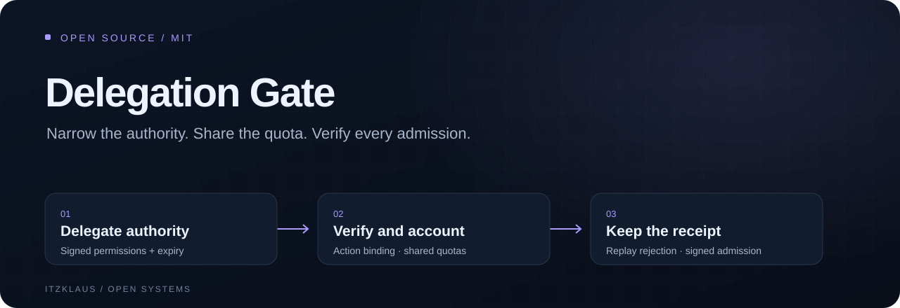

# Delegation Gate



[](https://github.com/itzKLAUS/delegation-gate/actions/workflows/check.yml) · [MIT](LICENSE) · [Release notes](CHANGELOG.md) · [Sponsor](https://github.com/sponsors/itzKLAUS)

## Install in your application

Python 3.11+. This release is available from GitHub; it is not claimed to be published on PyPI.

```sh
python -m pip install "git+https://github.com/itzKLAUS/delegation-gate.git@v0.2.0"
```

For development, clone the repository, enter its directory and use the locked commands below.

**Give an agent a smaller slice of authority, and enforce the shared limit.**

An agent supervisor can delegate one operation on one resource to a worker without handing over its root credential. Each delegation narrows signed permissions, lifetime, quota and further delegation depth. A trusted tool gateway verifies the chain and a short-lived worker-signed action proof, then atomically charges every ancestor's quota before returning a signed admission receipt.

This is a model-independent Python library for agent runtimes, tool adapters and automation gateways. It works without an LLM subscription. It is an initial implementation, not an independently audited security product or a claim of enterprise readiness.

## What is implemented

- Ed25519 grant, invocation and receipt signatures with separate signing domains.
- Pinned issuer key and gateway audience; exact resource/operation matching.
- Up to eight delegation hops; each child must narrow its parent's authority.
- Proofs bound to the leaf grant, action, argument digest, declared units and a maximum 60-second window.
- Durable replay rejection per worker key and request identifier.
- SQLite transactions charging all ancestors; siblings share their parent's cumulative quota.
- Ancestor revocation affecting descendants, including after process restarts.
- Immutable, versioned schemas with strict integer validation, field limits and unknown-field rejection.
- Signed, ordered admission-receipt export; no raw arguments or private keys in the ledger.
- Typed wheel and source distribution; dependency lock; Linux/Windows CI matrix.

## Operational evidence

Use `gate.receipt_page(after=0, limit=100)` for bounded signed-receipt export, `gate.grant_status(identity)` to observe local usage/direct revocation, and `gate.backup("new-snapshot.sqlite")` for an integrity-checked snapshot. A stale restore can resurrect consumed authority; follow the recovery guide before restarting admission.

## Run the synthetic integration

Python 3.11 or later and uv are required.

```sh
uv sync --locked
uv run python examples/demo.py
```

The demo creates ephemeral keys and a temporary ledger. An issuer authorizes a supervisor, which delegates a smaller grant to a worker. The gateway admits one synthetic report read and rejects replay, quota exhaustion and a revoked ancestor. Nothing is deployed and no external API is called.

```sh
uv run ruff check .
uv run ruff format --check .
uv run mypy src
uv run pytest --cov=delegation_gate --cov-fail-under=90
uv build --no-sources
```

See [related work](docs/ALTERNATIVES.md), [the integration contract](docs/INTEGRATION.md), [threat model](docs/THREAT_MODEL.md), [operations](docs/OPERATIONS.md) and [verification](docs/VERIFICATION.md).

## Critical integration boundary

The gateway must derive the operation, resource, argument digest and worst-case cost from the actual action. Copying these values from an untrusted proof defeats action binding and cost enforcement. Only execute the trusted adapter after `Gate.admit` returns successfully.

All workers must use the same durable local ledger. Copies of the database have independent counters. This library does not sandbox agents, restrict their network access, discover costs, authorize human reviewers, or guarantee exactly-once external side effects. Admission is charged even if execution fails or the process crashes; reconciliation must not automatically rerun an uncertain action. Receipts prove admission, not completion.

Licensed under [MIT](LICENSE). See [contributing](CONTRIBUTING.md), [support](SUPPORT.md) and [security reporting](SECURITY.md).
